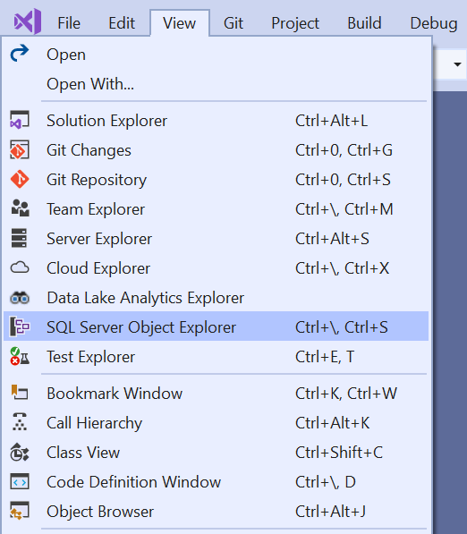
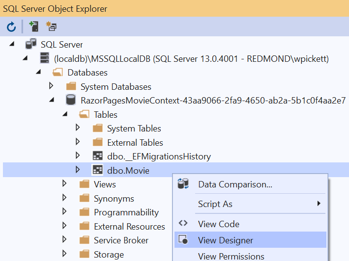

# Part 4, with a database and ASP.NET Core

By [Rick Anderson](https://twitter.com/RickAndMSFT) and [Joe Audette](https://twitter.com/joeaudette)

::: moniker range=">= aspnetcore-3.0"

[View or download sample code](https://github.com/dotnet/AspNetCore.Docs/tree/master/aspnetcore/tutorials/razor-pages/razor-pages-start/sample/RazorPagesMovie30) ([how to download](xref:index#how-to-download-a-sample)).

The `RazorPagesMovieContext` object handles the task of connecting to the database and mapping `Movie` objects to database records. The database context is registered with the [Dependency Injection](xref:fundamentals/dependency-injection) container in the `ConfigureServices` method in *Startup.cs*:

# [Visual Studio](#tab/visual-studio)

[!code-csharp[](razor-pages-start/sample/RazorPagesMovie30/Startup.cs?name=snippet_ConfigureServices&highlight=15-18)]

# [Visual Studio Code / Visual Studio for Mac](#tab/visual-studio-code+visual-studio-mac)

[!code-csharp[](razor-pages-start/sample/RazorPagesMovie30/Startup.cs?name=snippet_UseSqlite&highlight=11-12)]

---

The ASP.NET Core [Configuration](xref:fundamentals/configuration/index) system reads the `ConnectionString`. For local development, it gets the connection string from the *appsettings.json* file.

# [Visual Studio](#tab/visual-studio)

The name value for the database (`Database={Database name}`) will be different for the generated code. The name value is arbitrary.

[!code-json[](razor-pages-start/sample/RazorPagesMovie30/appsettings.json?highlight=10-12)]

# [Visual Studio Code / Visual Studio for Mac](#tab/visual-studio-code+visual-studio-mac)

[!code-json[](~/tutorials/razor-pages/razor-pages-start/sample/RazorPagesMovie/appsettings_SQLite.json?highlight=8-10)]

---

When the app is deployed to a test or production server, an environment variable can be used to set the connection string to a real database server. See [Configuration](xref:fundamentals/configuration/index) for more information.

# [Visual Studio](#tab/visual-studio)

## SQL Server Express LocalDB

LocalDB is a lightweight version of the SQL Server Express database engine that's targeted for program development. LocalDB starts on demand and runs in user mode, so there's no complex configuration. By default, LocalDB database creates `*.mdf` files in the `C:\Users\<user>\` directory.

<a name="ssox"></a>
* From the **View** menu, open **SQL Server Object Explorer** (SSOX).

  

* Right-click on the `Movie` table and select **View Designer**:

  

  

Note the key icon next to `ID`. By default, EF creates a property named `ID` for the primary key.

* Right-click on the `Movie` table and select **View Data**:

  

# [Visual Studio Code / Visual Studio for Mac](#tab/visual-studio-code+visual-studio-mac)

## SQLite

The [SQLite](https://www.sqlite.org/) website states:

> SQLite is a self-contained, high-reliability, embedded, full-featured, public-domain, SQL database engine. SQLite is the most used database engine in the world.

There are many third party tools you can download to manage and view a SQLite database. The image below is from [DB Browser for SQLite](https://sqlitebrowser.org/). If you have a favorite SQLite tool, leave a comment on what you like about it.


> [!NOTE]
> For this tutorial the Entity Framework Core *migrations* feature is used where possible. Migrations updates the database schema to match changes in the data model. However, migrations can only do the kinds of changes that the EF Core provider supports, and the SQLite provider's capabilities are limited. For example, adding a column is supported, but removing or changing a column is not supported. If a migration is created to remove or change a column, the `ef migrations add` command succeeds but the `ef database update` command fails. Due to these limitations, this tutorial doesn't use migrations for SQLite schema changes. Instead, when the schema changes, the database is dropped and re-created.
>
>The workaround for the SQLite limitations is to manually write migrations code to perform a table rebuild when something in the table changes. A table rebuild involves:
>
>* Creating a new table.
>* Copying data from the old table to the new table.
>* Dropping the old table.
>* Renaming the new table.
>
>For more information, see the following resources:
> * [SQLite EF Core Database Provider Limitations](/ef/core/providers/sqlite/limitations)
> * [Customize migration code](/ef/core/managing-schemas/migrations/#customize-migration-code)
> * [Data seeding](/ef/core/modeling/data-seeding)
  * [SQLite ALTER TABLE statement](https://sqlite.org/lang_altertable.html)

---

## Seed the database

Create a new class named `SeedData` in the *Models* folder with the following code:

[!code-csharp[](razor-pages-start/sample/RazorPagesMovie30/Models/SeedData.cs?name=snippet_1)]

If there are any movies in the DB, the seed initializer returns and no movies are added.

```csharp
if (context.Movie.Any())
{
    return;   // DB has been seeded.
}
```

<a name="si"></a>

### Add the seed initializer

In *Program.cs*, modify the `Main` method to do the following:

* Get a DB context instance from the dependency injection container.
* Call the seed method, passing to it the context.
* Dispose the context when the seed method completes.

The following code shows the updated *Program.cs* file.

[!code-csharp[](razor-pages-start/sample/RazorPagesMovie30/Program.cs)]

The following exception occurs when `Update-Database` has not been run:

> `SqlException: Cannot open database "RazorPagesMovieContext-" requested by the login. The login failed.`
> `Login failed for user 'user name'.`

### Test the app

# [Visual Studio](#tab/visual-studio)

* Delete all the records in the DB. Use the delete links in the browser or from [SSOX](xref:tutorials/razor-pages/new-field#ssox)
* Force the app to initialize (call the methods in the `Startup` class) so the seed method runs. To force initialization, IIS Express must be stopped and restarted. Stop and restart IIS with any of the following approaches:

  * Right-click the IIS Express system tray icon in the notification area and tap **Exit** or **Stop Site**:

    

    

    * If the app is running in non-debug mode, press F5 to run in debug mode.
    * If the app in debug mode, stop the debugger and press F5.

# [Visual Studio Code / Visual Studio for Mac](#tab/visual-studio-code+visual-studio-mac)

Delete all the records in the DB (So the seed method will run). Stop and start the app to seed the database.

The app shows the seeded data.

---

The next tutorial will improve the presentation of the data.

## Additional resources

> [!div class="step-by-step"]
> [Previous: Scaffolded Razor Pages](xref:tutorials/razor-pages/page)
> [Next: Updating the pages](xref:tutorials/razor-pages/da1)

::: moniker-end

::: moniker range="< aspnetcore-3.0"

[View or download sample code](https://github.com/dotnet/AspNetCore.Docs/tree/master/aspnetcore/tutorials/razor-pages/razor-pages-start) ([how to download](xref:index#how-to-download-a-sample)).

The `RazorPagesMovieContext` object handles the task of connecting to the database and mapping `Movie` objects to database records. The database context is registered with the [Dependency Injection](xref:fundamentals/dependency-injection) container in the `ConfigureServices` method in *Startup.cs*:

# [Visual Studio](#tab/visual-studio)

[!code-csharp[](razor-pages-start/sample/RazorPagesMovie22/Startup.cs?name=snippet_ConfigureServices&highlight=15-18)]

# [Visual Studio Code / Visual Studio for Mac](#tab/visual-studio-code+visual-studio-mac)

[!code-csharp[](razor-pages-start/sample/RazorPagesMovie22/Startup.cs?name=snippet_UseSqlite&highlight=11-12)]

---

For more information on the methods used in `ConfigureServices`, see:

* [EU General Data Protection Regulation (GDPR) support in ASP.NET Core](xref:security/gdpr) for `CookiePolicyOptions`.
* [SetCompatibilityVersion](xref:mvc/compatibility-version)

The ASP.NET Core [Configuration](xref:fundamentals/configuration/index) system reads the `ConnectionString`. For local development, it gets the connection string from the *appsettings.json* file.

# [Visual Studio](#tab/visual-studio)

The name value for the database (`Database={Database name}`) will be different for the generated code. The name value is arbitrary.

[!code-json[](razor-pages-start/sample/RazorPagesMovie22/appsettings.json)]

# [Visual Studio Code](#tab/visual-studio-code)

[!code-json[](~/tutorials/razor-pages/razor-pages-start/sample/RazorPagesMovie/appsettings_SQLite.json?highlight=8-10)]

# [Visual Studio for Mac](#tab/visual-studio-mac)

[!code-json[](~/tutorials/razor-pages/razor-pages-start/sample/RazorPagesMovie/appsettings_SQLite.json?highlight=8-10)]

---

When the app is deployed to a test or production server, an environment variable can be used to set the connection string to a real database server. See [Configuration](xref:fundamentals/configuration/index) for more information.

# [Visual Studio](#tab/visual-studio)

## SQL Server Express LocalDB

LocalDB is a lightweight version of the SQL Server Express database engine that's targeted for program development. LocalDB starts on demand and runs in user mode, so there's no complex configuration. By default, LocalDB database creates `*.mdf` files in the `C:/Users/<user/>` directory.

<a name="ssox"></a>
* From the **View** menu, open **SQL Server Object Explorer** (SSOX).

  

* Right-click on the `Movie` table and select **View Designer**:

  

  

Note the key icon next to `ID`. By default, EF creates a property named `ID` for the primary key.

* Right-click on the `Movie` table and select **View Data**:

  

# [Visual Studio Code](#tab/visual-studio-code)

[!INCLUDE[](~/includes/rp/sqlite.md)]
[!INCLUDE[](~/includes/RP-mvc-shared/sqlite-warn.md)]

# [Visual Studio for Mac](#tab/visual-studio-mac)

[!INCLUDE[](~/includes/rp/sqlite.md)]
[!INCLUDE[](~/includes/RP-mvc-shared/sqlite-warn.md)]

---

## Seed the database

Create a new class named `SeedData` in the *Models* folder with the following code:

[!code-csharp[](razor-pages-start/sample/RazorPagesMovie22/Models/SeedData.cs?name=snippet_1)]

If there are any movies in the DB, the seed initializer returns and no movies are added.

```csharp
if (context.Movie.Any())
{
    return;   // DB has been seeded.
}
```

<a name="si"></a>

### Add the seed initializer

In *Program.cs*, modify the `Main` method to do the following:

* Get a DB context instance from the dependency injection container.
* Call the seed method, passing to it the context.
* Dispose the context when the seed method completes.

The following code shows the updated *Program.cs* file.

[!code-csharp[](razor-pages-start/sample/RazorPagesMovie22/Program.cs)]

A production app would not call `Database.Migrate`. It's added to the preceding code to prevent the following exception when `Update-Database` has not been run:

SqlException: Cannot open database "RazorPagesMovieContext-21" requested by the login. The login failed.
Login failed for user 'user name'.

### Test the app

# [Visual Studio](#tab/visual-studio)

* Delete all the records in the DB. You can do this with the delete links in the browser or from [SSOX](xref:tutorials/razor-pages/new-field#ssox)
* Force the app to initialize (call the methods in the `Startup` class) so the seed method runs. To force initialization, IIS Express must be stopped and restarted. You can do this with any of the following approaches:

  * Right-click the IIS Express system tray icon in the notification area and tap **Exit** or **Stop Site**:

    

    

    * If the app is running in non-debug mode, press F5 to run in debug mode.
    * If the app in debug mode, stop the debugger and press F5.

# [Visual Studio Code](#tab/visual-studio-code)

Delete all the records in the DB (So the seed method will run). Stop and start the app to seed the database.

The app shows the seeded data.

# [Visual Studio for Mac](#tab/visual-studio-mac)

Delete all the records in the DB (So the seed method will run). Stop and start the app to seed the database.

The app shows the seeded data.

---

The app shows the seeded data:


The next tutorial will clean up the presentation of the data.

## Additional resources

* [YouTube version of this tutorial](https://youtu.be/A_5ff11sDHY)

> [!div class="step-by-step"]
> [Previous: Scaffolded Razor Pages](xref:tutorials/razor-pages/page)
> [Next: Updating the pages](xref:tutorials/razor-pages/da1)

::: moniker-end
